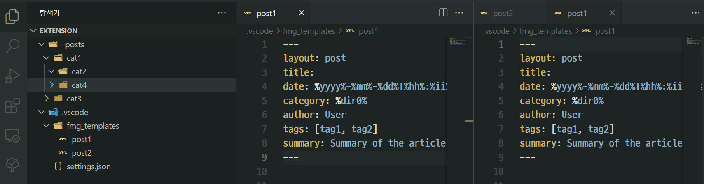

# Front Matter Gen

> This is a fork of Abdillah/vscode-belikejekyll and rohgarg/jekyll-post. I added a dirname placeholder and made it possible to select multiple user templates.

Markdown Front Matter Generator for VS Code.

This extension makes it easier to create new blog posts for Jekyll-like
websites using the Visual Studio Code editor.

Using this extension, a user can create new post file with pre-filled
"front matter". The template for front matter can either be provided by the
user or the extension will use its built-in template.

## Usage instructions



1. settings.json: `frontmattergen.enabled` = true
2. right click on a directory in the explorer menu
3. select the "New Post" option.
4. select template (case template file > 1)
5. a dialog box prompts the user
   to provide the name of the file.

If a user wants to provide a template file for new posts, they should create
a file: `.vscode/fmg_templates/{file}` relative to current project root directory.

Here's an example of the template file:

```bash
$ cat $PROJECT_ROOT/.vscode/fmg_templates/post
---
layout: post
title:
date: %yyyy%-%mm%-%dd%T%hh%:%ii%:%ss%Z
category: %dir0%
author: User
tags: [tag1, tag2]
summary: Summary of the article
---
```

If no template is provided, the extension will use its built-in template for
new posts. The default template is as follows:

```
---
layout: post,
title: This is a new article
date: %yyyy%-%mm%-%dd% %hh%:%ii%
category: Category
author: User
tags: [tag1, tag2]
summary: Summary of the article
---
```

## Features

- Adds a new explorer context menu option to create new blog posts
- Sets up the file name automatically in the configurable format
- Ability to provide a template file for new post, use predefined if not supplied

### Supported Placeholder

The following placeholder can be used both in filename and inside template.

- `%yyyy%`: Year
- `%mm%`: Month
- `%dd%`: Day of month
- `%hh%`: Hour
- `%ii%`: Minute
- `%ss%`: Second
- `%filename%`: Name of supplied file plus extension
- `%dir0%`: Name of file's dirname

dir name : dir0~N

```
 file's path : D:\workspaceFolders\category1\category2\2021-12-26-new-post.md
```

- `%dir0%`: category2
- `%dir1%`: category1
- `%dir2%`: workspaceFolders

## Requirements

This has only been tested on the latest release (v.1.63.2) of Visual Studio
Code. It may or may not work on earlier releases.

## Extension Settings

- `frontmattergen.enabled`: enable extension
- `frontmattergen.template.path`: template path
- `frontmattergen.instance.filename`: filename pattern
- `frontmattergen.filename.extension`: filename extension
- `frontmattergen.filename.default`: new filename

---

- https://github.com/rohgarg/jekyll-post
- https://github.com/Abdillah/vscode-belikejekyll

---
